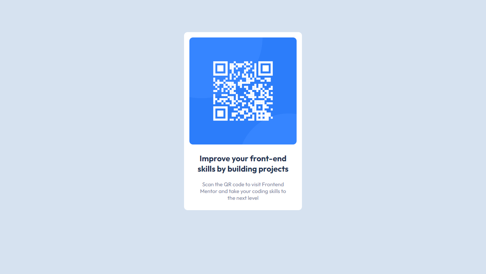

# Frontend Mentor - QR code component solution

## Table of contents

- [Overview](#overview)
  - [Screenshot](#screenshot)
  - [Links](#links)
  - [Built with](#built-with)
- [Author](#author)

## Overview

### Screenshot

### Links

- Solution URL: [https://github.com/DouglasReis98/qr_code-component]
- Live Site URL: [https://douglasreis98.github.io/qr_code-component/]

### Built with

- HTML5 markup
- CSS custom properties

## Author

- Website - [http://douglasreis.epizy.com]
- Frontend Mentor - [@DouglasReis98](https://www.frontendmentor.io/profile/DouglasReis98)
- LinkedIn - [@douglas-reis98](https://www.twitter.com/yourusername)
